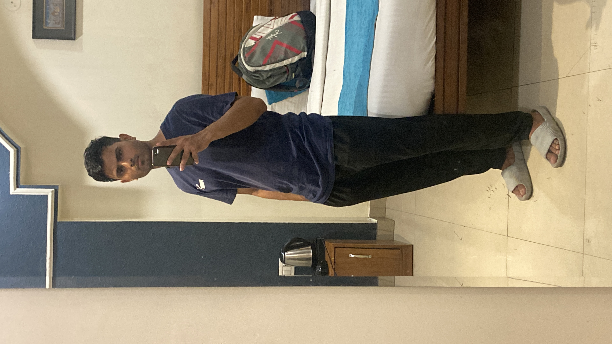
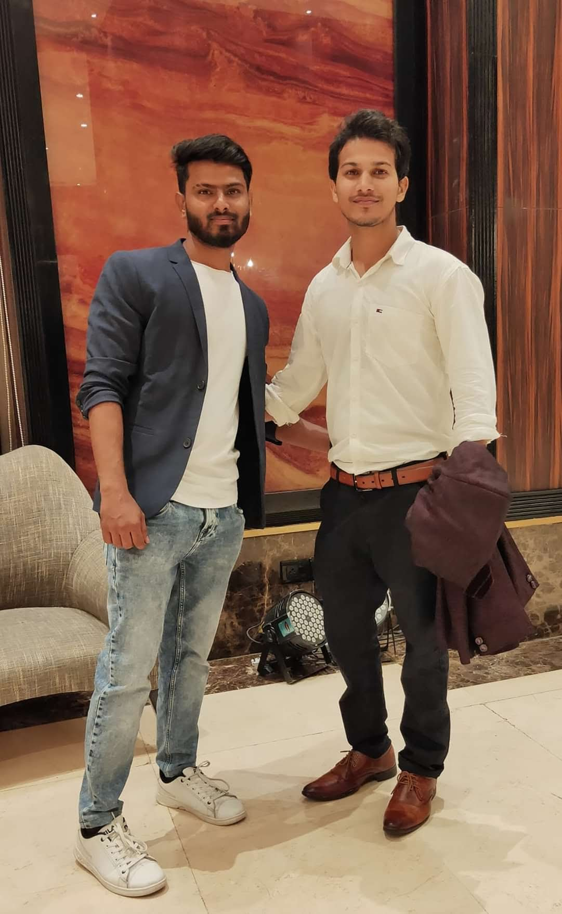
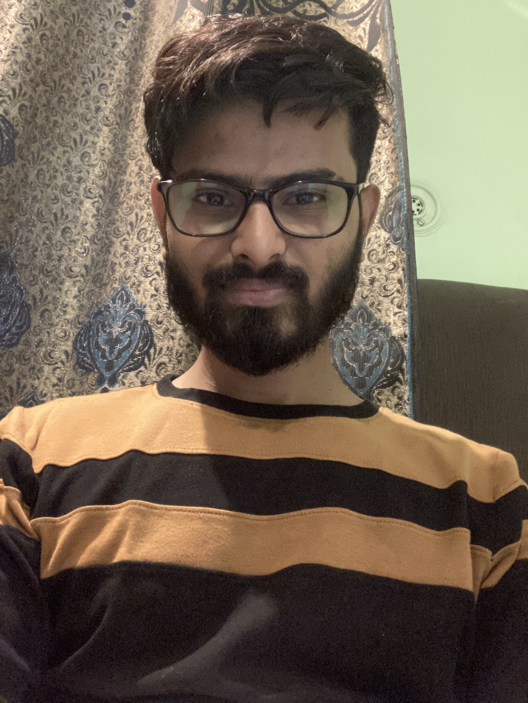

## Alok Chauhan

### About

|    |    |
|----|----|
|Date of Birth| 24th September 1994|
|Height| 5' 6''|
|Complexion| Wheatish |
|Native Place| Mainpuri|

### Contact Information
`Ph. No.` : 9811910368

### What I do?
A shape rotator who applies Probability, Statistics, and Mathematics in my daily work, while also creating cutting-edge generative AI applications.
Here's my Linkedin [profile](https://www.linkedin.com/in/alokkik).

### Interests

`Trekking` Kheerganga, Kedarnath, Valley of flowers, Chopta, Khaliya Top, Thamri Kund and some off-beat treks\
`Gym` Regular gym goer \
`Cricket` Bowling (Right Arm Fast) : [Profile](https://cricheroes.com/player-profile/22092437/alok/stats) \
`Reading` Prefers genre `History, Psychology, Philosophy, Science and Enterpreneurship` \
`Coding` Writing code is my profession \
`Meditation` Vipassna practitioner \
`Chess` Play online tournaments(Chess.com) : [Profile](https://www.chess.com/stats/live/rapid/imallok)

### Personality Traits
`Calm`
`Mindful`
`Healthful`
`Thoughtful`
`Rationalist`
`Ponderer`

### Education

| Qualification  | Year  | Institution |
|:---:|:---:|:---:|
| `High school`  | `2010`  | `JKG School` |
| `Intermediate` | `2012`  | `JKG School` |
| `B.Tech. Computer Science`  | `2017`  | `ABES Engineer College(UPTU)`|

### Career
`Sr. Data Scientist` with 6 years of work experience, currently employed with `Publicis Sapient, Noida`.

### Family Details

|  Name  |  Relation  |  Education  | Occupation |
|:----:|:----:|:----:|:----:|
| Mr. Ramesh Chauhan | Father | | Business |
| Mrs. Suman Chauhan | Mother | | Homemaker|
| Sweve | Brother | B.A Economic Honors| Studying|
| Shruti | Sister | B.Com Honors | Studying|

### Books Read
- श्रीमद्भगवद्गीता      
- अष्टावक्र गीता    
- *My Gita* by Devdutt Pattanaik      
- *Sapiens: A Brief History of Humankind* by Yuval Noah Harari      
- *Glimpses of World History* by Jawaharlal Nehru      
- *A Brief History of Time* by Stephen Hawking      
- *Atomic Habits* by James Clear      
- *The Alamanack of Naval Ravikant* by Eric Jorgenson      
- *The Lean Startup* by Eric Ries        
- *The Diary of a Young Girl* by Anne Frank      
- *The Alchemist* by Paulo Coelho

### Photos

  
 Click! 📸 

  
  
  
  
  

