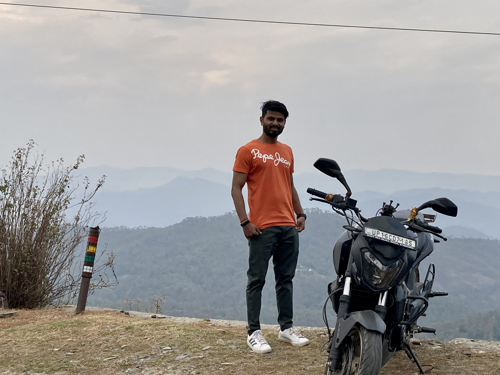

## Alok Chauhan

  
Photos

  
  
  
  
  
  

### About

|    |    | 
|----|----|
|Date of Birth| 24th September 1994|
|Height| 5' 6''|
|Complexion| Warm Beige|
|Native Place| Mainpuri|

### Interests
`Trekking` Kheerganga, Kedarnath, Valley of flowers, Chopta, Vaishno devi and some off-beat treks\
`Gym` Regular gym goer \
`Cricket` Right arm fast bowler \
`Reading` Prefered genre History, Psychology, Philosophy, Technology and Enterpreneurship \
`Coding` Write code as my profession \
`Meditation` Vipassna practitioner

### Education

| Qualification  | Year  | Percentage  |
|:---:|:---:|:---:|
| `High school`  | `2010`  | `8.4 CGPA` |
| `Intermediate` | `2012`  | `72`       |
| `B.Tech. Computer Science`  | `2017`  | `62`     |

### Professional Journey

| Company Name | Designation   |  Duration  | Location|
|:--------------:|:---------------:|:------------:|:---------:|
| Fishtail.ai | ML Engineer | Feb 2022 - Present · 1 yr 9 mos | Remote|
| Exl Services | Lead Assistant Manager | Sept 2021 - June 2022 · 9 mos| Gurgaon |
| AlphaCrest Capital Management | Data Scientist | May 2020 - Aug 2021 · 1 yr 4 mos| Noida|
| Biz2Credit Infoservices | Data Scientist | Aug 2018 - Apr 2020 · 1 yr 9 mos | Noida|
| Semusi| Machine Learning Engineer | Jun 2017 - Mar 2018 · 10 mos | Noida|

### Family Details

|  Name  |  Relation  |  Education  | Occupation |
|:----:|:----:|:----:|:----:|
| Mr. Ramesh Chauhan | Father | | Small Business |
| Mrs. Suman Chauhan | Mother | | Homemaker|
| Sweve | Brother | B.A Economic Honors| Studying|
| Shruti | Sister | B.Com Honors | Studying|
